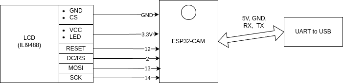

# Instructions for board setup
## Before Build
Before building you need to set WiFi SSID and Password in `wifi.hpp` file and set server IP and port in the `main.cpp` file.

## Build environment
- [esp-idf](https://github.com/espressif/esp-idf) (tested on version 5.1.2) 
    - I personally used VSCode with esp-idf extension

## Wiring

## Build process (using VSCode)
1. Clone repository
2. `cd smart-fridge/code/`
3. `code .`
4. Fill wifi SSID and password. Edit pin numbers if needed.
5. Open vscode quick-launch (`Ctrl+Shift+P`)
6. `ESP-IDF: Build your project` (assuming ESP-IDF extension to be configured)
    - Or `ESP-IDF: Build, Flash and Start Monitor on your Device` to directly flash and monitor.

## Controls
- Board is currently responsive to 3 console commands:
    - `send` - sends example temperature and humidity data to the server
    - `start scan` - starts code scanning. Shows camera view on the display. After successful scan of the code, the scan automatically stops and sends scanned data to the server
    - `stop scan` - manually stops scanning. No code is read

- Board is permanently connected to given server. If connection fails it tries to reconnect every second. If any data is received they are interpreted as notifications on the display.

- Any message received from the server will be displayed on the bottom of the display.

### Types of notifications:
- No type - white color
- Low priority (1) - green color
- Medium priority (2) - yellow color
- High priority (3) - red color

### Display layout
- Camera preview when scanning
- Temperature and humidity
- Notifications

### Server connection
The board has continuously open connection to the web server. If the connection fails the board tries to reconnect automatically.
